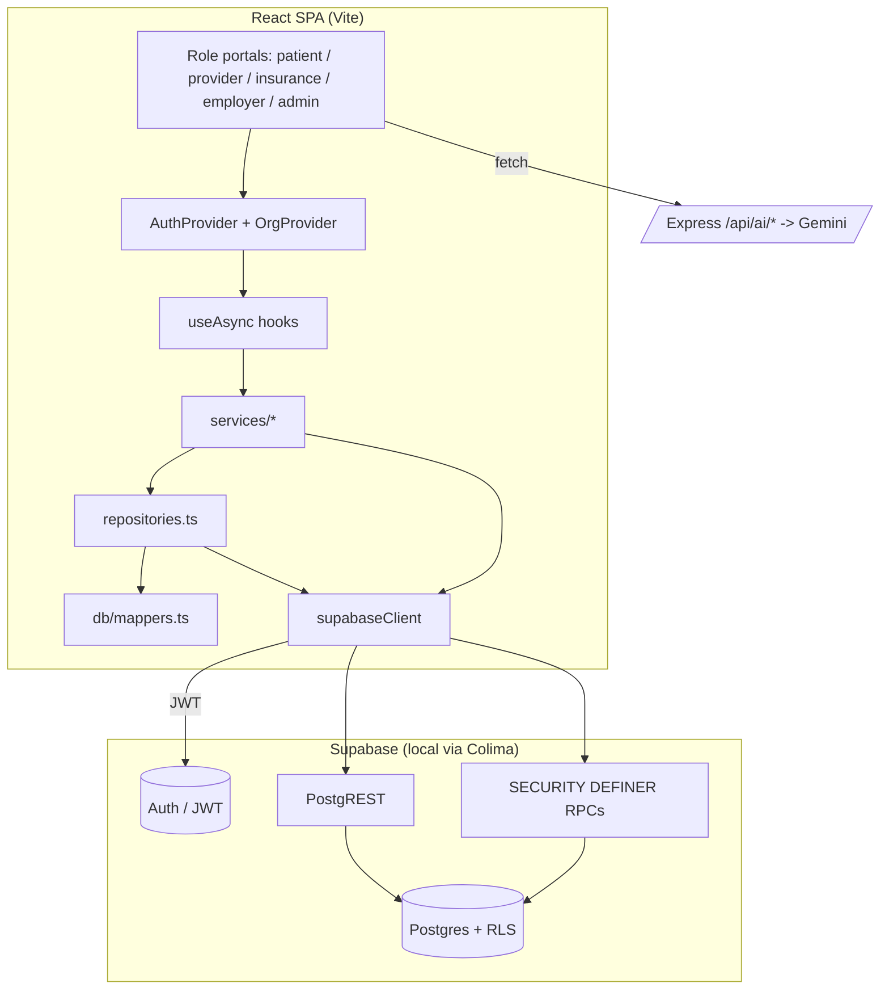
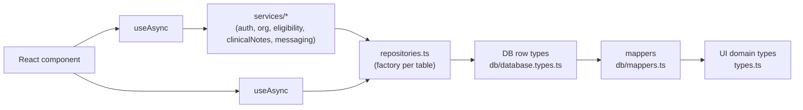

# SBOS HealthOS — Architecture

## Stack
- **Frontend:** React 19 + Vite 6 + TypeScript + Tailwind CSS v4, `lucide-react`,
  `motion`. Single-page app.
- **Backend (this lane):** Supabase (Postgres + Auth + PostgREST + RPC). The
  browser talks to Supabase directly via `@supabase/supabase-js`; RLS is the
  security boundary.
- **Server (`server.ts`, separate backend lane):** Express, hosts `/api/ai/*`
  (Google Gemini proxy) + `/api/health`. Maintained on `phase-0-foundations`.
- **Local dev infra:** Colima (Docker runtime) + Supabase CLI.

## High-level system



## Data-access layers (the core pattern)



- **`db/database.types.ts`** — snake_case row types + join view types, mirroring Postgres.
- **`db/mappers.ts`** — pure row→domain mappers (every one unit-tested).
- **`repositories.ts`** — `createRepositories(client)` factory; one typed repo per
  table (`list`, `getById`, `create`, `update`, domain-specific methods). Testable
  with a fake client.
- **`services/*`** — business operations spanning repos/RPCs/auth
  (`authService`, `organizationService`, `eligibilityService`,
  `clinicalNotesService`, `messagingService`).
- **`hooks/useAsync.ts`** — load/error/enabled state; every screen falls back to
  demo data when Supabase is unconfigured (so a keyless clone still runs).

## Authentication & session

```mermaid
sequenceDiagram
  participant U as User
  participant App as React (authContext)
  participant Auth as Supabase Auth
  participant DB as Postgres (RLS)
  U->>App: email + password (LoginScreen)
  App->>Auth: signInWithPassword
  Auth-->>App: session (JWT with sub = auth.uid())
  App->>DB: getCurrentProfile() -> public.users row
  DB-->>App: role + organization_id
  App->>App: gate portal by role; requests carry JWT
  DB->>DB: RLS uses auth.uid() + current_user_org_id()
```

- `public.users` is a profile table keyed 1:1 to `auth.users(id)`; a trigger
  auto-creates it on signup. Passwords live only in `auth.users`.

## Row-Level Security model
- **Tenant isolation:** helper `current_user_org_id()` (SECURITY DEFINER) reads the
  caller's org; most tables enforce `organization_id = current_user_org_id()`.
- **Ownership:** patients read their own PHI (`patient_id IN (select id from
  patients where user_id = auth.uid())`); provider/admin staff read the org's.
- **Cross-org, controlled:** where a role legitimately needs cross-org data
  (payer eligibility, thread participation), access goes through **audited
  SECURITY DEFINER functions** (`check_eligibility`, `is_thread_participant`,
  `create_message_thread`) instead of broad policies.
- **Directory:** `organizations` is publicly readable (non-PHI tenant directory).

## AI
Client calls `POST /api/ai/*` on the Express server, which proxies Google Gemini
(model via `GEMINI_MODEL`). Used for BIRP note generation, claims FWA analysis,
benefits/eligibility explanations, and the Jessie assistant. See AI.md.

## Deployment (target, not yet done)
Hosted Supabase (HIPAA plan + BAA) for DB/Auth/Storage; the Express server on a
container host (Cloud Run/Fly/etc.); the SPA as static assets. See OPERATIONS.md.
Current state is **local only** (Colima + Supabase CLI).
