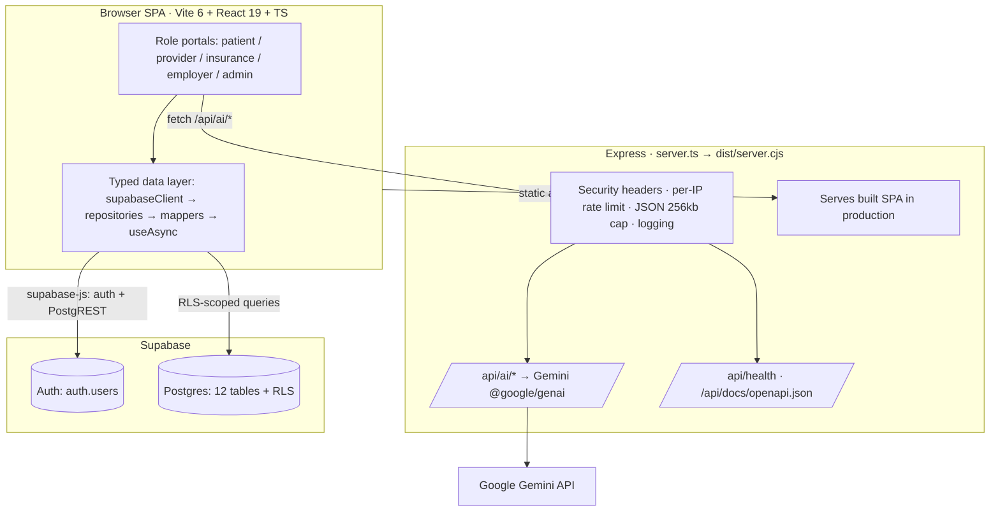
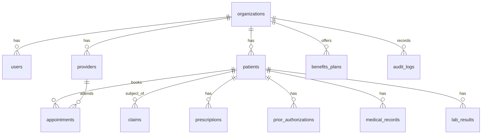
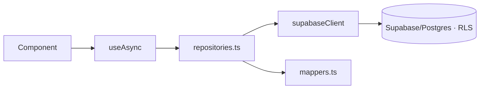
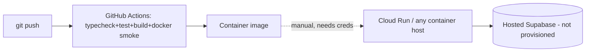

# ARCHITECTURE — SBOS HealthOS

Grounded in the actual repository. If code and this document disagree, the code
wins — fix the document.

## High-level

## Frontend

- **Stack:** Vite 6, React 19, TypeScript, Tailwind (`@tailwindcss/vite`),
  `lucide-react` icons, `motion` for animation.
- **Entry:** `index.html` → `src/` app. Portals under `src/components/<role>`.
- **State/data:** components call the data layer (below) via the `useAsync`
  hook, which standardizes loading/error/data and supports a demo fallback.
- The SPA talks to Supabase **directly** for data; it only calls the Express
  backend for `/api/ai/*`.

## Backend

- **Single file:** `server.ts`, bundled by esbuild to `dist/server.cjs`.
- **Responsibilities:** serve the built SPA (production) or proxy Vite (dev);
  expose `/api/health`, `/api/ai/*`, `/api/docs/openapi.json`.
- **Middleware order (matters):** `express.json({limit:'256kb'})` → security
  headers → `/api` rate limit (120/min) → `/api/ai` rate limit (15/min) →
  request logging → routes → `/api` JSON 404 → SPA/static → error handler.
- Details in [API](API.md) and repo `docs/BACKEND.md`.

## Database

- Supabase Postgres. 12 tables, 7 enums, ~20 RLS policies, 3 helper functions,
  across 6 migrations in `supabase/migrations/`. See [DATABASE](DATABASE.md).

## Repository layer

`src/lib/repositories.ts` exposes typed accessors:
`organizations`, `users`, `patients`, `appointments`, `claims`,
`prescriptions`, `priorAuths`, `auditLogs`. Each returns a normalized
`{ data, error }` result. Rows (snake_case, `src/lib/db/database.types.ts`) are
converted to UI domain types via `src/lib/db/mappers.ts`.

## Services & contexts

- `src/lib/services/authService.ts` — Supabase Auth (`signInWithPassword`, etc.).
- `src/lib/services/organizationService.ts` — org/tenant data.
- `src/lib/authContext.tsx`, `src/lib/organizationContext.tsx` — React contexts
  for the signed-in user and active tenant.
- `src/lib/permissions.ts` — client-side RBAC helpers (tested).

## Authentication & RLS

- **AuthN:** Supabase Auth. `public.users` is a profile table keyed to
  `auth.users(id)`; a `handle_new_user` trigger provisions the profile.
- **AuthZ:** Postgres RLS keyed on `current_user_org_id()` / `current_user_role()`
  for tenant isolation and role scoping. Claims are payer-scoped by default with
  an added patient/provider visibility policy.
- The Express AI endpoints are **not** authenticated today (see
  [SECURITY](SECURITY.md)).

## AI

- `@google/genai` (Gemini). One memoized client with a configurable upstream
  timeout. Three endpoints (chat, clinical notes, fraud analysis). Without
  `GEMINI_API_KEY`, endpoints return deterministic demo payloads. See [AI](AI.md).

## Deployment

- Multi-stage `Dockerfile` (Node 22 alpine): build → prod-deps → runner
  (non-root, `HEALTHCHECK`). `docker-compose.yml` for local run.
- `terraform/` sketches GCP (Cloud Run + Cloud SQL) but is **not** applied and
  duplicates the Supabase data plane — an open architecture decision
  ([DECISIONS](DECISIONS.md#d5)).

