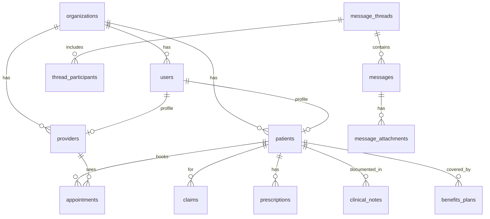

# SBOS HealthOS — Database

Postgres via Supabase. Multi-tenant, RLS-enforced. All types are hand-mirrored in
`src/lib/db/database.types.ts` (regenerate/cross-check with
`supabase gen types typescript --local`).

## Conventions
- Tenant column: `organization_id` (most tables). Isolation via
  `organization_id = public.current_user_org_id()`.
- PHI ownership: patient reads own via `patient_id IN (select id from patients
  where user_id = auth.uid())`.
- Timestamps `created_at` default now(); ids `uuid` default `uuid_generate_v4()`.

## Enums
`user_role` (patient/provider/insurance/employer/admin) ·
`claim_status` (submitted/in_review/adjudicated/approved/denied/paid) ·
`appointment_type` (telehealth/in_person/urgent_care/specialist) ·
`appointment_status` (scheduled/in_progress/completed/cancelled) ·
`rx_status` (active/refill_requested/expired/discontinued) ·
`prior_auth_status` (pending/approved/denied/info_requested) ·
`org_type` (health_system/payer/employer_group/clinic).

## Tables

### organizations
Tenant directory + white-label settings. Cols: name, type, tax_id, npi, subdomain,
custom_domain, colors, plan_tier, monthly_rate, active_enrollees, renewal_date,
billing_status, users_count, `permissions` jsonb, `branding` jsonb.
**RLS:** SELECT public (non-PHI directory); UPDATE by tenant admin on own org
(`organizations_admin_update_own`); other writes service-role only.

### users (profile)
1:1 with `auth.users(id)`. Cols: organization_id, email, role, full_name, phone,
is_active. Auto-created by `handle_new_user()` trigger on signup.
**RLS:** read self or same-org; update self.

### patients
EHR demographics + clinical profile. Cols: user_id, organization_id, dob, gender,
address, insurance_member_id (unique), policy_group_number, blood_type,
allergies/chronic_conditions jsonb, `recent_vitals` jsonb, `family_members` jsonb,
primary_care_physician. **RLS:** patient-self read; org staff all.

### providers
Directory + credentials. Cols: user_id, organization_id, npi (unique), specialty,
license_number, accepting_new_patients, consultation_fee, full_name, rating,
review_count, in_network, hospital_affiliation, address, phone,
next_available_slot, avatar_url, bio, education. **RLS:** org tenant.

### appointments
Cols: patient_id, provider_id, organization_id, appointment_type, status,
scheduled_at, telehealth_room_url, chief_complaint. **RLS:** org tenant.

### claims
Cols: claim_number (unique), patient_id, provider_id, payer_organization_id,
organization_id (servicing), service_date, total_billed, approved_amount,
patient_copay, status, icd10_codes/cpt_codes jsonb, ai_risk_score/flags,
plain_english_explanation, denormalized patient_name/provider_name/provider_npi,
paid_amount, paid_at, denial_reason. **RLS:** payer (`payer_organization_id`),
patient-self, and org staff (`claims_org_staff`).

### prescriptions
Cols: patient_id, provider_id, organization_id, medication_name, dosage,
frequency, refills_remaining, status, pharmacy_name. **RLS:** org tenant.

### prior_authorizations
Cols: patient_id, provider_id, organization_id, requested_service, icd10_code,
cpt_code, status, clinical_notes, ai_recommendation. **RLS:** org tenant.

### lab_results
Cols: patient_id, ordering_provider_id, organization_id, loinc_code, test_name,
result_value, reference_range, status, result_date. **RLS:** org tenant (from
auth/RLS migration).

### medical_records
Cols: patient_id, organization_id, record_date, type (Lab Result/Immunization/
Visit Summary/Imaging), title, doctor, facility, summary, status, file_url.
**RLS:** patient-self read; org staff all.

### benefits_plans
Cols: patient_id, organization_id, plan_id, plan_name, network_type, deductible +
OOP fields, `copays` jsonb. **RLS:** patient-self read; org staff all.

### employer_groups / employer_members
Employer census. groups: company_name, group_number, active_enrollees, plan_type,
monthly_premium_total, renewal_date, wellness_participation_rate, status.
members: employer_group_id, organization_id, full_name, job_role, plan, status,
dependents, premium_monthly. **RLS:** org tenant.

### clinical_notes / treatment_plans / assessments
Clinical documentation. notes: note_type (BIRP/SOAP/PROGRESS), `content` jsonb,
suggested_icd/cpt jsonb, status (draft/signed), signed_at. plans: title, diagnosis,
goals/interventions jsonb, status, review_date. assessments: instrument, score,
severity, responses jsonb, administered_at. **RLS:** patient-self read; org staff all.

### message_threads / thread_participants / messages / message_attachments
Secure messaging. threads: subject, created_by, last_message_at. participants:
thread_id, user_id, last_read_at (read receipts). messages: thread_id, sender_id,
body. attachments: message_id, file_name, content_type, size_bytes, storage_path
(metadata; upload pending Storage). **RLS:** participant-based via
`is_thread_participant()`; thread creation via `create_message_thread()` RPC.

### audit_logs
Immutable trail. Cols: organization_id, actor_id, action, resource_type,
resource_id, details, ip_address, timestamp. **RLS:** org read; append-only insert.

## Functions / RPCs (SECURITY DEFINER)
- `current_user_org_id()` / `current_user_role()` — caller context (no recursion).
- `handle_new_user()` (trigger on `auth.users`) — creates the profile row.
- `check_eligibility(member_id)` — controlled cross-org coverage summary
  (insurance/admin/provider only).
- `is_thread_participant(thread_id)` — messaging access check.
- `create_message_thread(subject, participant_ids[], body)` — atomic thread + participants + first message.

## Relationships (simplified)

## Migrations (apply order via `supabase db reset`)
1. `20260724000000_enterprise_schema` 2. `20260725000000_auth_integration_rls`
3. `..010000_patient_profile_fields` 4. `..020000_claims_visibility`
5. `..030000_medical_records` 6. `..040000_benefits_plans`
7. `..050000_provider_profile` 8. `..060000_employer` 9. `..070000_org_settings`
10. `..080000_claims_lifecycle` 11. `..090000_eligibility_rpc` 12. `..100000_clinical`
13. `..110000_messaging`. Seed: `supabase/seed.sql`.

## Future changes
Add `telehealth_sessions`, `notifications`, `ai_conversations/ai_messages`,
`payments`; per-role write RLS; `organization_id` on any remaining thin tables;
audit-on-read triggers.
