# SBOS HealthOS — Module Dependency Graph (credentials vs offline)

Classifies remaining work by what it needs. **Offline** = buildable now with only
local Supabase (once disk is restored). **Credential/Infra** = needs something
only the owner can provide.

## Summary

```mermaid
flowchart TB
  subgraph OFFLINE["✅ Buildable offline (local Supabase only)"]
    TH[Telehealth session history/notes]
    ERX[e-Prescribing wiring]
    LAB[Lab Integration wiring]
    INSCARD[Insurance Card modal]
    HDR[Header -> real orgs/users]
    MSGX[Messaging enhancements: threads UI polish, provider<->provider, notifications model]
    PROF[Patient profile editing]
    EMERG[Emergency contacts]
    MEDHX[Medication history view]
    PROV[Provider workspace: schedule, tasks, timeline, dashboard]
    ADMIN[Admin: reporting, operational dashboard]
    RBACW[Per-role write RLS]
    AUDR[Audit-on-read + triggers]
    TESTS[Component/integration tests]
    JAIP[Jessie: conversation persistence + chart-context retrieval]
  end

  subgraph CRED["🔑 Needs credentials / infra (owner)"]
    STRIPE[Bill Pay -> Stripe keys]
    STORAGE[Document uploads / attachments -> Supabase Storage]
    INVITE[Tenant provisioning + user invitations -> service-role key + email/SMTP]
    GEMKEY[Jessie live output -> GEMINI_API_KEY + provider BAA]
    HOST[Hosted deploy -> Supabase HIPAA plan + BAA, domain/DNS, secrets]
    MFA[MFA/SMS -> Auth provider config]
    WEBRTC[Telehealth video -> WebRTC/TURN provider]
  end

  STORAGE -. blocks .-> MSGATT[Message attachments upload]
  STORAGE -. blocks .-> DOCS[Patient document uploads]
  STRIPE -. blocks .-> STRIPEUI[Real payment posting]
  INVITE -. blocks .-> USERMGMT[Admin user management]
  GEMKEY -. enables .-> JAIP
  HOST -. gates .-> PHI[Any real PHI usage]
```

## Offline-buildable now (no credentials)
| Module | Backing tables (exist?) | Notes |
|---|---|---|
| Telehealth session history/notes | needs new `telehealth_sessions` | appointments already carry room URL; link notes to `clinical_notes` |
| e-Prescribing wiring | `prescriptions` ✅ | replace mock in `ElectronicPrescribing` |
| Lab Integration wiring | `lab_results` ✅ | replace mock in `LabIntegrationHub` |
| Insurance Card modal | `patients` + `benefits_plans` ✅ | replace `samplePatient`/`sampleBenefitsPlan` |
| Header real orgs/users | `organizations`/`users` ✅ | retire `mockTenants`/`mockUsers` |
| Messaging enhancements | messaging tables ✅ | provider↔provider (multi-recipient), notifications model, realtime |
| Patient profile editing | `patients` ✅ | add patient-own UPDATE RLS policy + edit UI |
| Emergency contacts | extend `patients` (jsonb) | migration + UI |
| Medication history | `prescriptions` ✅ | history view (statuses over time) |
| Provider workspace | `appointments`/`patients`/`clinical_notes` ✅ | schedule, tasks (new `tasks` table), timeline, dashboard |
| Admin reporting/ops dashboard | existing tables ✅ | aggregate reads |
| Per-role write RLS | — | tighten existing policies |
| Audit-on-read + triggers | `audit_logs` ✅ | DB triggers / service calls |
| Component/integration tests | — | RTL + signed-in RLS harness |
| Jessie persistence + context | needs `ai_conversations`/`ai_messages` | retrieval uses existing tables; live *output* needs GEMINI_API_KEY |

## Credential/Infra-blocked (owner-provided)
| Item | Requires |
|---|---|
| Bill Pay (real payments) | **Stripe** secret/publishable keys + webhook secret |
| Document uploads / message attachments (binary) | **Supabase Storage** bucket (currently disabled locally) |
| Tenant provisioning + user invitations / user creation | Supabase **service-role key** (admin auth API) + **email/SMTP** |
| Jessie live responses | **GEMINI_API_KEY** (+ model BAA before real PHI) |
| MFA / SMS OTP | Auth provider / SMS credentials |
| Telehealth video | **WebRTC/TURN** provider |
| Any real PHI / production | Hosted HIPAA Supabase + **signed BAA**, domain/DNS, production secrets |

## Sequencing guidance
Build the **offline** column now (Telehealth data + the 5 mock-only wirings +
provider/admin surfaces + tests). Defer the **credential** column until the owner
supplies keys; keep each behind a service abstraction so wiring the real provider
is a one-file change (e.g. a `paymentsService`, `storageService`).
